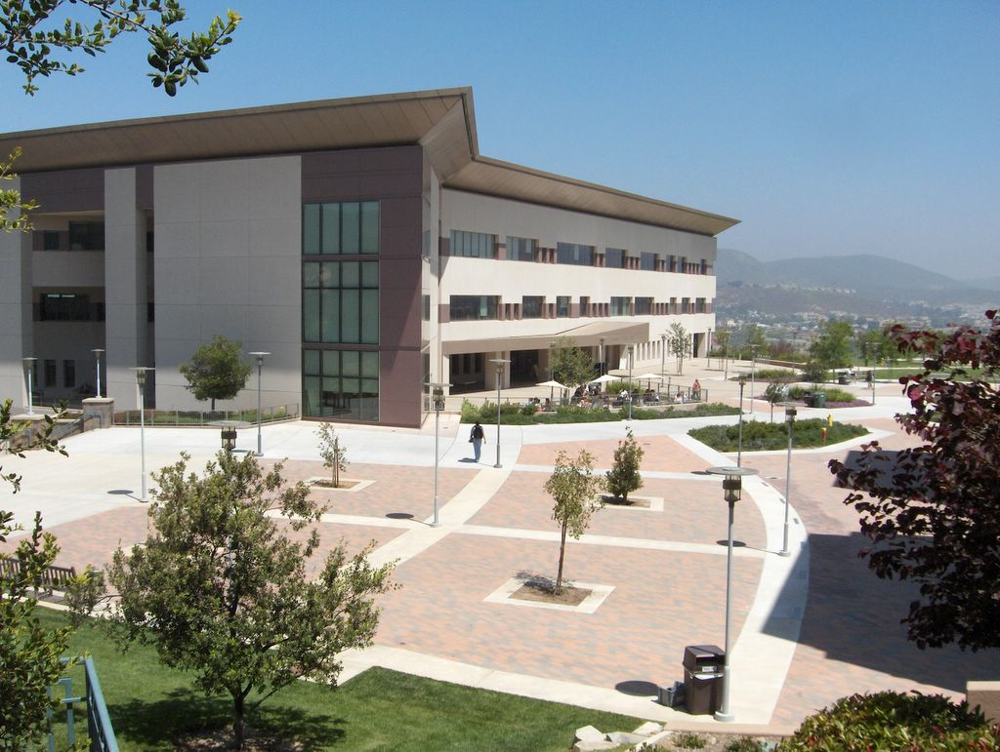

This is the first post on my new blog - how exciting!

I am a California State University San Marcos graduate with a Bachelor’s degree in Computer Science. This site marks the beginning of my professional career - a journey which begins at <a href="https://planning.center">Planning Center</a>

In this space I will be sharing my experience as the Summer 2019 Front-End intern at Planning Center, along with my thoughts and reflections relating to the workspace. I look forward to working with (and learning from) the talented team at Planning Center.

> 
